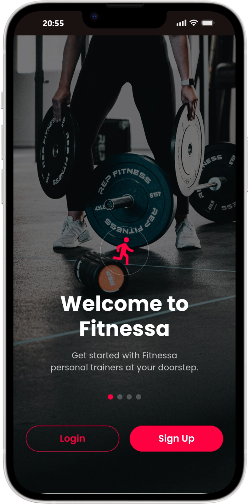
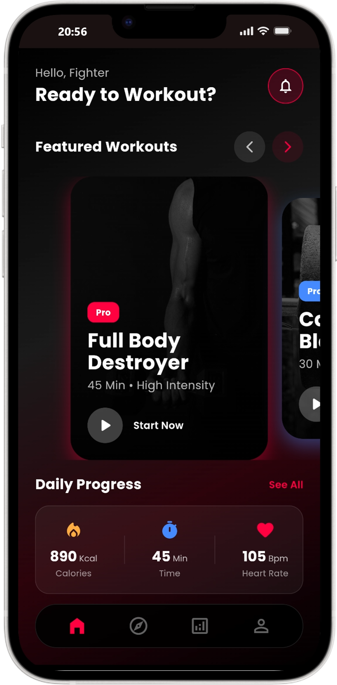
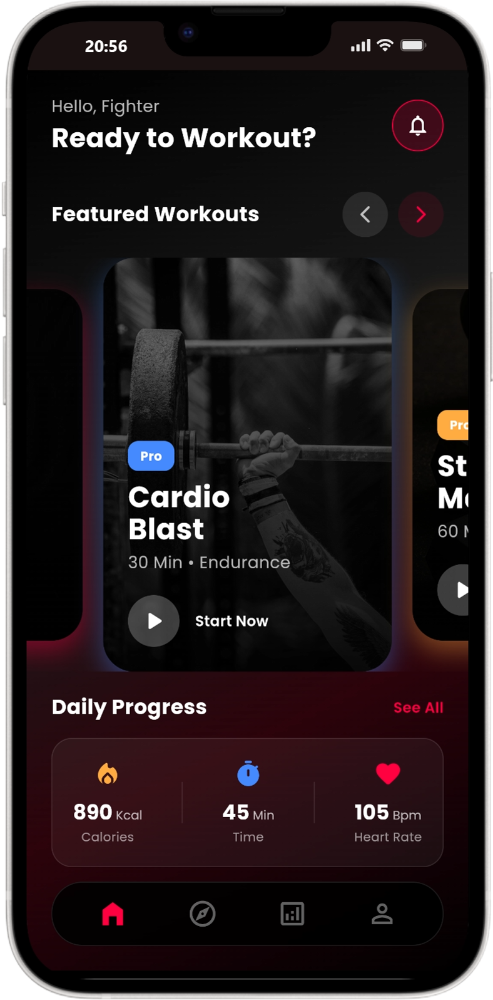
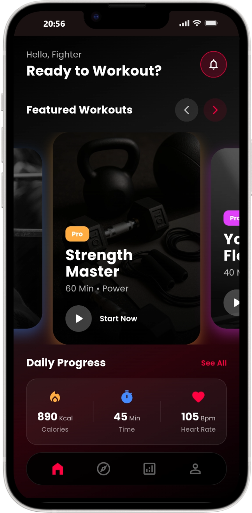
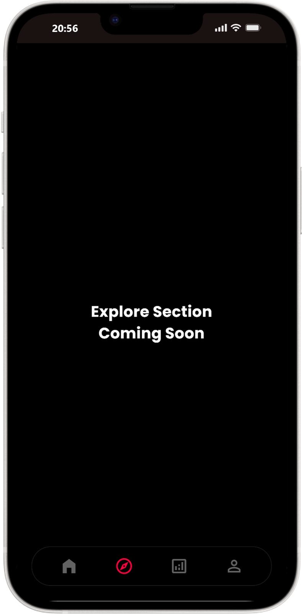

# Fitness App

A premium fitness application built with Flutter, focused on providing a clean and modern user experience.

## App Screenshots

  
  
  
  
  

## Features

- **Home Dashboard**: View your daily progress and upcoming workouts.
- **Workout Tracking**: Detailed breakdown of exercises and sets.
- **Analytics**: Visual graphs to monitor your fitness journey.
- **Profile Management**: Manage your personal info and settings.

## Getting Started

To run this project locally:

1. Clone the repository
2. Run `flutter pub get`
3. Run `flutter run`
